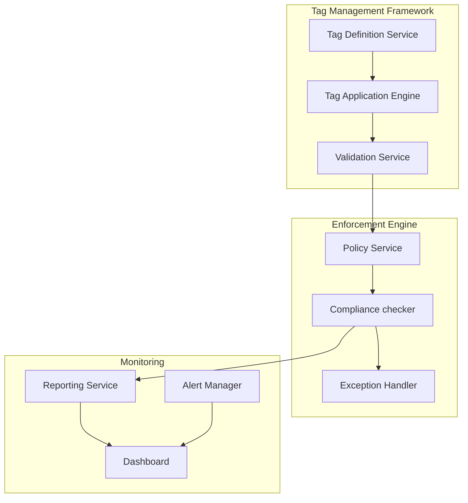

# Cloud Resource Tagging Remediation - Design Document
Version 1.0 | Date: November 1, 2024

## 1. Executive Summary
This document outlines the technical design for implementing a standardized tagging strategy across Azure and GCP cloud environments. The solution will establish consistent resource tagging, automated enforcement, and compliance monitoring.

## 2. System Architecture

### 2.1 Overview
The tagging remediation system consists of three main components:
- Tag Management Framework
- Enforcement Engine
- Monitoring & Reporting System

### 2.2 Architecture Diagram


## 3. Technical Specifications

### 3.1 Tag Structure
```json
{
    "mandatory_tags": {
        "environment": ["prod", "dev", "test", "stage"],
        "cost_center": "string (format: CC-XXXXX)",
        "owner": "string (email format)",
        "project": "string",
        "security_level": ["high", "medium", "low"]
    },
    "optional_tags": {
        "application": "string",
        "backup": ["yes", "no"],
        "maintenance_window": "string"
    }
}
```

### 3.2 Platform-Specific Implementation

#### 3.2.1 Azure Implementation
- Resource Group level inheritance
- Azure Policy definitions
- Azure CLI automation scripts
- Tag enforcement through Azure Policy

#### 3.2.2 GCP Implementation
- Project-level organization
- Label key restrictions
- Cloud Asset Inventory integration
- Organization policy constraints

## 4. Implementation Strategy

### 4.1 Wave Approach
| Wave | Scope | Timeline | Success Criteria |
|------|--------|----------|------------------|
| 1    | Non-production resources | Week 5 | 95% compliance |
| 2    | Production resources | Week 6 | 100% compliance |

### 4.2 Automation Framework
- Git repository structure
- CI/CD pipeline configuration
- Automated validation checks
- Rollback procedures

## 5. Enforcement Policies

### 5.1 Policy Rules
1. All new resources must have mandatory tags
2. Existing resources must be compliant within 24 hours
3. Non-compliant resources will trigger alerts
4. Exception process for special cases

### 5.2 Exception Handling
- Documentation requirements
- Approval workflow
- Time-bound exceptions
- Review process

## 6. Monitoring & Reporting

### 6.1 Compliance Metrics
- Tag coverage percentage
- Policy violation count
- Exception statistics
- Resource compliance status

### 6.2 Dashboards
- Real-time compliance status
- Trend analysis
- Exception tracking
- Cost allocation by tag

## 7. Security Controls

### 7.1 Access Management
- Role-based access control
- Privileged access workflow
- Audit logging
- Change tracking

### 7.2 Data Protection
- Tag value encryption
- Sensitive information handling
- Audit trail retention
- Backup procedures

## 8. Testing Strategy

### 8.1 Test Plans
| Test Type           | Description                  | Success Criteria     |
| ------------------- | ---------------------------- | -------------------- |
| Unit Testing        | Individual component testing | 100% coverage        |
| Integration Testing | Cross-component workflow     | All paths tested     |
| Performance Testing | Load and stress testing      | <2s response time    |
| UAT                 | Business scenario validation | Stakeholder approval |

### 8.2 Validation Approach
- Automated testing framework
- Test environment setup
- Test data management
- Results documentation

## 9. Operational Considerations

### 9.1 Support Model
- L1/L2/L3 support structure
- Escalation procedures
- SLA definitions
- Knowledge base

### 9.2 Maintenance Procedures
- Regular compliance checks
- Policy updates
- Exception reviews
- Performance optimization

## 10. Technical Dependencies

### 10.1 Prerequisites
- Cloud platform access
- API permissions
- Tool installations
- Network connectivity

### 10.2 Integration Requirements
- Identity management
- Monitoring systems
- CMDB integration
- Reporting tools

## 11. Risk Mitigation

### 11.1 Technical Risks
| Risk | Impact | Mitigation |
|------|---------|------------|
| API Rate Limiting | High | Implement backoff strategy |
| Data Loss | Critical | Backup and validation |
| Performance Impact | Medium | Batch processing |
| Integration Failure | High | Fallback procedures |

### 11.2 Operational Risks
- Resource accessibility
- Business continuity
- Change management
- Resource constraints

## 12. Documentation Requirements

### 12.1 Technical Documentation
- API documentation
- Code documentation
- Architecture diagrams
- Configuration guides

### 12.2 Operational Documentation
- User guides
- Troubleshooting guides
- Process workflows
- Training materials

## Appendices

### A. Reference Documentation
- Azure Tagging Best Practices
- GCP Labeling Standards
- Compliance Requirements
- Industry Standards

### B. Change Log
| Version | Date | Author | Changes |
|---------|------|---------|---------|
| 1.0 | 2024-11-01 | Cloud Team | Initial Version |

### C. Approval
| Role | Name | Date |
|------|------|------|
| Technical Lead | | |
| Security Lead | | |
| Operations Lead | | |
| Project Sponsor | | |
